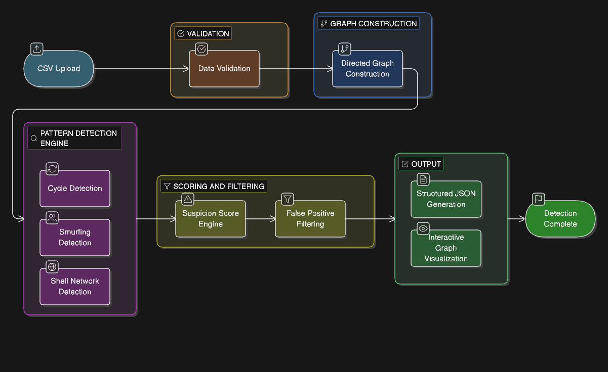

# UNMASK
## Graph-Based Financial Crime Detection Engine

#### 1. Project Title
**UNMASK — A Graph-Based Financial Forensics Engine for Money Muling Detection**

#### 2. Live Demo URL
**Live Application:**
[https://un-mask-hqzr.vercel.app/](https://un-mask-hqzr.vercel.app/)

**Demo Video (LinkedIn Submission):**
[[LinkedIn Video Link](https://www.linkedin.com/posts/abhinavbombale_rifthackathon-moneymulingdetection-financialcrime-activity-7430434864811843584-FFxz?utm_source=share&utm_medium=member_desktop&rcm=ACoAAF1SK9YBTX1R8JIl1O2aPrqq2i9JTr5PjD4)]

#### 3. Tech Stack
| Component | Technology |
| :--- | :--- |
| **Frontend** | React (Vite), JavaScript (ES6+), Tailwind CSS |
| **Visualization** | D3.js (Force-directed graph rendering), HTML5 Canvas (large-scale graph optimization) |
| **Backend** | Python (FastAPI / Flask), Pandas (CSV parsing & preprocessing), NetworkX / Custom adjacency structures (graph modeling) |
| **Deployment** | Frontend: Vercel, Backend: Render / Railway |

*Publicly accessible (no authentication, as required)*

#### 4. Problem Context
Money muling is a structured financial crime mechanism where illicit funds are layered across networks of accounts to obscure origin and destination. Traditional relational queries are insufficient to detect these multi-hop, cyclic, and temporally clustered patterns.

**UNMASK** models transaction datasets as directed graphs and applies structured graph algorithms to detect:
*   Circular fund routing (cycles)
*   Smurfing patterns (fan-in / fan-out)
*   Layered shell networks

The system strictly adheres to the required input structure and JSON output format defined in the RIFT 2026 problem statement.

#### 5. System Architecture

**Architectural Design Principles**
*   Separation of concerns (frontend visualization independent from detection logic)
*   Deterministic JSON output (strict format compliance)
*   Efficient graph traversal (bounded complexity)
*   Scalable rendering (LOD-based visualization for large graphs)
*   False positive mitigation mechanisms

#### 6. Algorithm Approach
**6.1 Graph Construction**
Each transaction forms a directed edge: `sender_id → receiver_id`

**Data structures:**
*   Adjacency list representation
*   In-degree and out-degree maps
*   Timestamp-indexed transaction records
*   Transaction count per account

*Time Complexity: O(E) where E = number of transactions*

**6.2 Cycle Detection (Circular Fund Routing)**
*Objective: Detect cycles of length 3–5.*

**Method:**
*   Depth-limited DFS
*   Prevent duplicate cycle detection via canonical ordering
*   Maintain visited path tracking

All accounts within a cycle are assigned the same `ring_id`.

*Time Complexity: Worst-case O(V × (V + E)), constrained via depth limit = 5, pruned traversal, and early termination on closure.*

**6.3 Smurfing Detection (Fan-In / Fan-Out)**
*   **Fan-In:** ≥ 10 unique senders → 1 receiver (within a 72-hour rolling window)
*   **Fan-Out:** 1 sender → ≥ 10 receivers (within a 72-hour window)

**Implementation:**
*   Transactions sorted by timestamp
*   Sliding window temporal clustering
*   Unique counter sets

*Time Complexity: O(E log E) (timestamp sorting + window scan)*

**6.4 Layered Shell Networks**
*Objective: Detect chains of ≥3 hops where intermediate accounts have low activity (≤3 total transactions).*

**Method:**
*   Multi-hop traversal
*   Intermediate node degree threshold filter

*Time Complexity: O(V + E)*

#### 7. Suspicion Score Methodology
Each account receives a normalized score between 0 and 100.

**Base Weights**
| Pattern Detected | Weight |
| :--- | :--- |
| Cycle Participation | 40 |
| Fan-In Aggregator | 30 |
| Fan-Out Distributor | 30 |
| Shell Intermediary | 25 |
| High Transaction Velocity | 15 |
| Multiple Pattern Overlap | +20 bonus |

**Normalization**
Final score: `score = min(100, weighted_sum)`
Accounts are sorted in descending order of `suspicion_score` as required.

**Fraud Ring Risk Score**
`Ring risk score = Average(suspicion_score of member_accounts)`

#### 8. False Positive Control
To satisfy precision requirements:
*   Merchant pattern recognition (consistent daily flow)
*   Payroll schedule detection
*   Repeated interval analysis
*   Degree-based noise filtering
*   Suspicious-first rendering for high-density graphs

The system is designed to avoid flagging legitimate high-volume merchants, payroll disbursement systems, or repeated recurring payments.

#### 9. Performance Optimization
*Requirement: Processing ≤ 30 seconds for datasets up to 10,000 transactions.*

**Optimizations:**
*   Efficient adjacency lists
*   Depth-limited DFS
*   Precomputed degree maps
*   Timestamp indexing
*   Suspicious-focused visualization mode for large datasets
*   Label suppression above node thresholds
*   Canvas-based rendering for dense graphs
*   Automatic Level-of-Detail rendering

*Large datasets automatically activate filtering mode to prevent graph hairball effects.*

#### 10. Usage Instructions
1.  Open the live application.
2.  Upload a CSV file with the required structure.
3.  Analysis begins automatically.
4.  **View:**
    *   Network Graph
    *   Fraud Ring Matrix
    *   Suspicious Accounts
5.  **Download** structured JSON report.

The JSON format strictly matches required output specifications.

#### 11. Known Limitations
*   Extremely dense networks (>15K nodes) require cluster-based filtering for readability.
*   Cycle detection limited to length ≤5 as per problem requirement.
*   Visualization prioritizes suspicious-focused view for scalability.
*   Designed for structured transaction datasets; not integrated with live banking APIs.
*   Precision/recall dependent on threshold configuration.

#### 12. Compliance With Evaluation Criteria
This solution addresses:
*   Clear graph-based modeling of money muling
*   Exact JSON format compliance
*   Cycle, smurfing, and shell detection
*   Suspicion scoring methodology
*   False positive mitigation
*   Performance constraints
*   Interactive visualization
*   Comprehensive documentation

#### 13. Team Members
*   Abhinav Bombale
*   Anannya Wakalkar
*   Gauri Gaikwad
